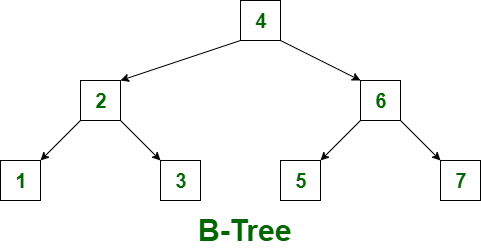

# Binary tree

Root -> 1 node
each level below Root -> 2 node
left is lesser than value of the parent node, right is more

## Why Btree is better than linkedlist
If we store in linkedlist we have to traverse the whole data structure to find, that's linear time. If data set doubles, search time becomes double

Btree cuts the amount of time u need to find in half. 

## Two types of B Tree
B Tree and B+ Tree

### Rules creating a B tree
Set a number for minimum, maximum number of keys in a btree node
say eg 4 max, 2 min
Root node is exempted from that rule

insert 1, 2, 3, 4 keys into the root node, 
At 5 insert, root will overflow
When root overflows, say 5 numbers, split the keys into half, 2 goes to the left node, 2 to the right , and the middle one becomes the new root node.
Repeat the same process when a node overflows

Delete data
Search for the key, and then delete it
If deleting the key results in node having less than minimum number of keys. Take a key from a node next to it, either left or right. Take largest if left, and smallest if right.
If this causes the parent node to be unbalanced, take the key from the left/right and put it in the node, and the key in the node to the child node to meet the minimum number of keys.
If taking from sibling will result in them falling under minimum number of keys, merge 2 nodes together and form 1 node.