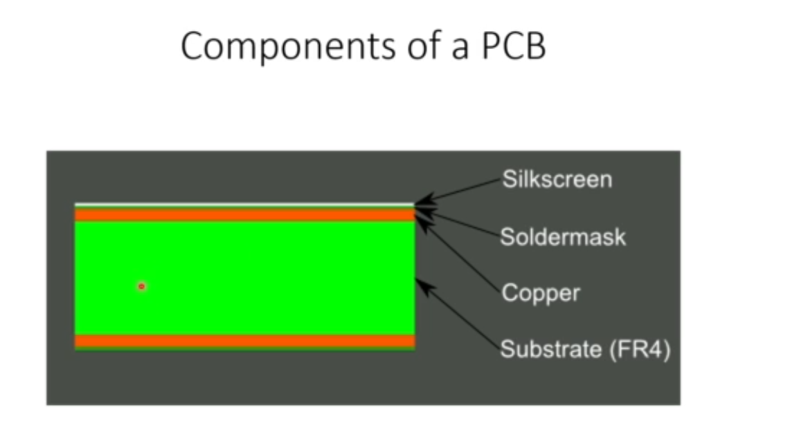

# PCB component

## PCB Basics

Substrate - provides mechanical support to all copper and all components on top attached to the copper. FR4 is made up of glass and resin

Copper - conductor, in the form of thin strips.

Soldermask - layer on top of copper foil, determines the colour of pcb. thin filament to prevent solder from breaching. Can be green or black. Gives the pcb its colour.

Silkscreen - white silkscreen is applied on top of the solder mask layer. Adds letter, numbers and symbol to the pcb.

## Types of PCB

### SIngle sided PCB
2 sides, solder side and component side

### Double sided pcb
PCB are printed with wiring pattern on both side. 

### Multi layer board
Make use of more than 2 pcbs with a thin layer of prepreg material paced between each layer, making it a sandwich assembly. Used for boards that are too dense. 

### Terminology
Trace - continous path of copper on circuit board
Plane - a continous block of copper on a circuit board
Pad - a portion exposed on the surfaced of a board to which component is soldered
Via - a hole in a board used to pass a signal from one layer to another
Annular ring - the ring of copper around a plated through hole in PCB
Plated through hole - a hole on a board that has an annular ring which is plated all the way through the board
Slot - any hole in a board which is not round. Slots may or may not be plated

### Types of connection
Through hole and surface mount