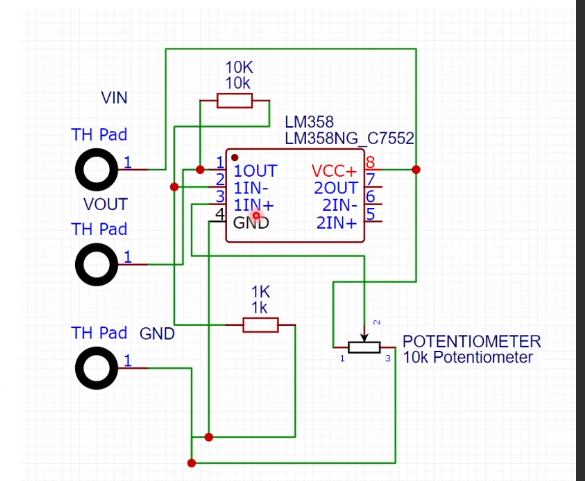

# PCB Design Basics

## Intro

CAD - Computer Aided Design 
EDA - Electronic design automation - used to design pcb

## PCB Design process
1) Schematic Design
2) PCB Layout
3) Output

### Schematic diagram 
Graphical representation of connections of electronic components

### PCB Layout
Design to be transfered to an actualy CAD drawing of circuit board
Dimension of board realised, along with placements of components.
Good PCB layout makes fabbing the board easier
There are no hard rules on how to draw PCB layout

## Measurement Units
Mil is 1/1000th of an inch also called thou
Mil and millimeters (mm) are different units
100 mil (0.1 inch) = 2.54 mm
200 mil (0.2 inch) = 5.08 mm

## Routing
Routing is the stage which the designer routes the copper connections between the components.

The CAD software will have route tool to assist.

## Output
Manufacture PCB step and determine materials used